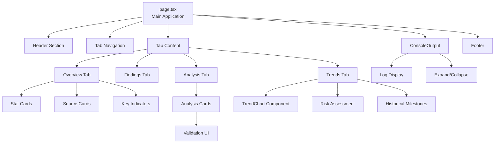
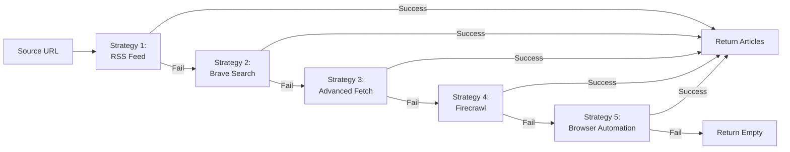
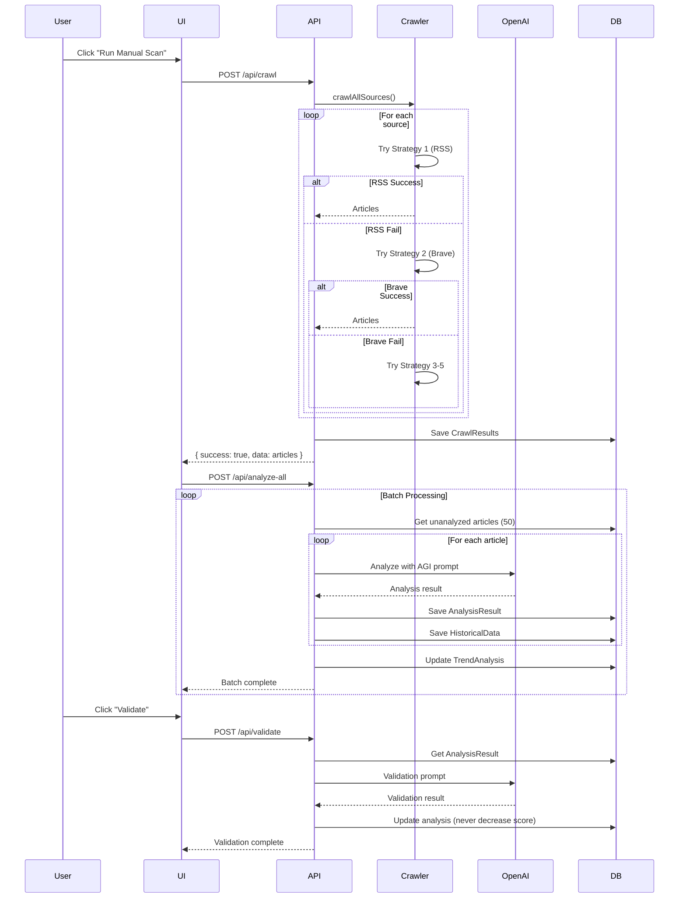
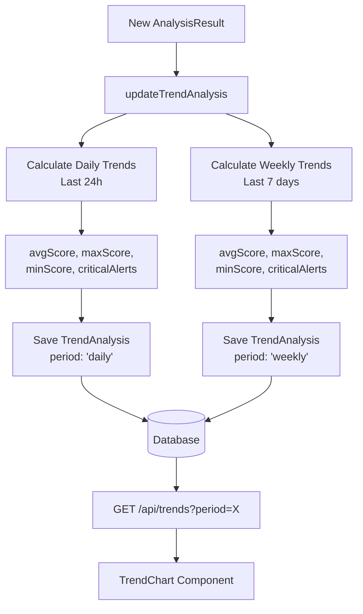
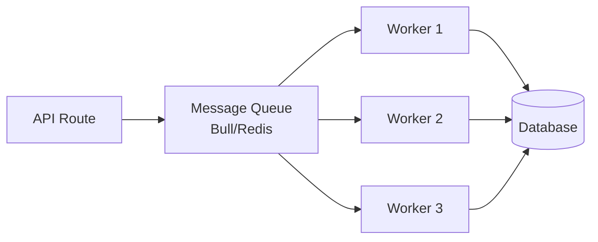
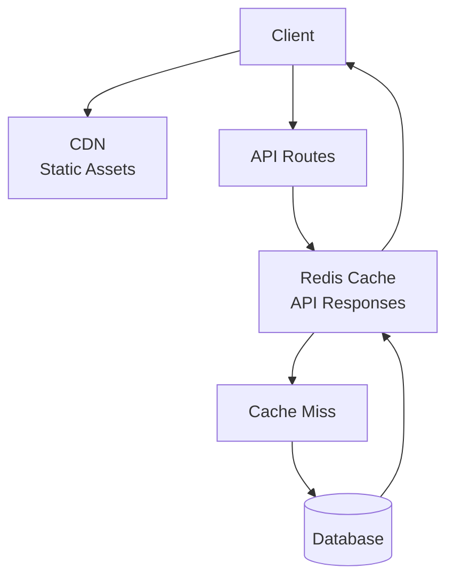
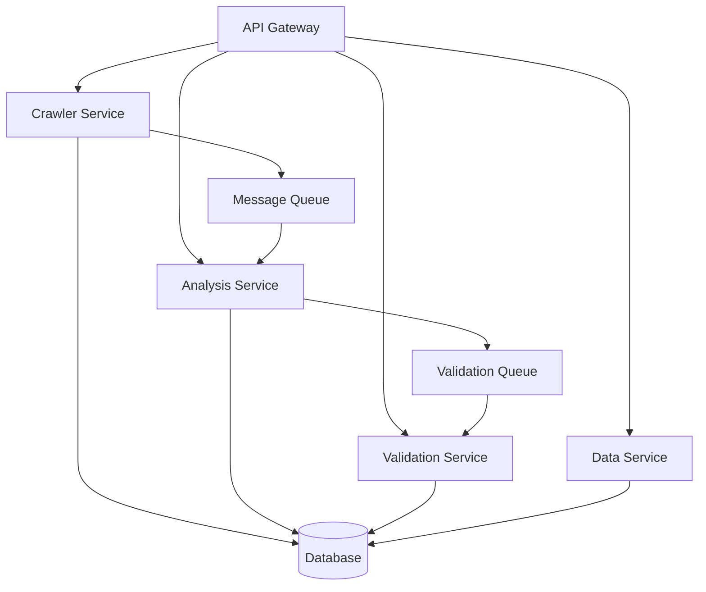

# AGI Detector - Architecture Overview

**Generated:** 2025-11-17  
**Version:** 1.0  
**Status:** Comprehensive Analysis

---

## Executive Summary

The AGI Detector is a sophisticated Next.js 15 full-stack application designed to monitor and analyze AI research sources for early indicators of Artificial General Intelligence (AGI) emergence. The system combines advanced web crawling, AI-powered analysis using GPT-4o-mini, and real-time monitoring capabilities with a modern, Anthropic-inspired UI.

### Key Highlights
- **46 TypeScript files** across frontend and backend
- **Next.js 15 App Router** architecture with React 19
- **PostgreSQL database** with Prisma ORM
- **Multi-strategy web crawler** with 5 fallback mechanisms
- **OpenAI GPT-4o-mini** for AGI detection analysis
- **7 monitored sources** including OpenAI, DeepMind, Anthropic, Microsoft AI, arXiv, TechCrunch, and VentureBeat
- **Real-time validation system** for cross-checking analysis results
- **Comprehensive security hardening** including SSRF protection and input validation

---

## System Architecture

### High-Level Architecture Diagram

```mermaid
graph TB
    subgraph "Client Layer"
        UI[Next.js Frontend<br/>React 19 + TypeScript]
        Console[Real-time Console]
        Charts[Data Visualization]
    end
    
    subgraph "API Layer"
        Router[Next.js API Routes]
        Crawl[/api/crawl]
        Analyze[/api/analyze]
        Validate[/api/validate]
        Data[/api/data]
        Trends[/api/trends]
    end
    
    subgraph "Service Layer"
        Crawler[Multi-Strategy Crawler]
        OpenAI[OpenAI Service]
        Security[URL Validator]
        Prisma[Prisma ORM]
    end
    
    subgraph "Data Layer"
        DB[(PostgreSQL<br/>Neon)]
    end
    
    subgraph "External Services"
        RSS[RSS Feeds]
        Brave[Brave Search API]
        Firecrawl[Firecrawl API]
        Browser[Playwright Browser]
        OpenAIAPI[OpenAI API]
    end
    
    UI --> Router
    Console --> Router
    Charts --> Trends
    
    Router --> Crawl
    Router --> Analyze
    Router --> Validate
    Router --> Data
    Router --> Trends
    
    Crawl --> Crawler
    Analyze --> OpenAI
    Validate --> OpenAI
    Data --> Prisma
    Trends --> Prisma
    
    Crawler --> Security
    Crawler --> RSS
    Crawler --> Brave
    Crawler --> Firecrawl
    Crawler --> Browser
    
    OpenAI --> OpenAIAPI
    Prisma --> DB
    
    style UI fill:#e1f5ff
    style Router fill:#fff4e6
    style Crawler fill:#f3e5f5
    style DB fill:#e8f5e9
```

---

## Tech Stack

### Frontend
| Technology | Version | Purpose |
|------------|---------|---------|
| **Next.js** | 15.1.4 | React framework with App Router |
| **React** | 19.0.0 | UI library |
| **TypeScript** | 5.x | Type-safe development |
| **TailwindCSS** | 3.4.1 | Utility-first styling |
| **CSS Variables** | - | Theme system (Anthropic-inspired) |

### Backend
| Technology | Version | Purpose |
|------------|---------|---------|
| **Node.js** | 20+ | Runtime environment |
| **Next.js API Routes** | 15.1.4 | Serverless API endpoints |
| **Prisma** | 6.2.1 | Database ORM |
| **OpenAI SDK** | 4.78.1 | AI integration |
| **Axios** | 1.7.9 | HTTP client |
| **Cheerio** | 1.0.0 | HTML parsing |
| **Playwright** | 1.52.0 | Browser automation |

### Database
| Technology | Purpose |
|------------|---------|
| **PostgreSQL** | Primary database |
| **Neon** | Serverless Postgres hosting |
| **Prisma Client** | Type-safe database access |

### External APIs
| Service | Purpose | Fallback Priority |
|---------|---------|-------------------|
| **OpenAI API** | AGI detection analysis | Required |
| **RSS Feeds** | Primary crawl source | Strategy 1 |
| **Brave Search API** | Site-restricted search fallback | Strategy 2 |
| **Firecrawl** | JS-rendered page crawling | Strategy 4 |
| **Playwright** | Browser automation | Strategy 5 |

### Development & Testing
| Technology | Purpose |
|------------|---------|
| **Jest** | Unit testing |
| **Testing Library** | React component testing |
| **ESLint** | Code linting |
| **ts-jest** | TypeScript testing support |

---

## Directory Structure

```
agi-detector/
├── src/
│   ├── app/                          # Next.js App Router
│   │   ├── api/                      # API Routes (16 endpoints)
│   │   │   ├── analyze/              # Single article analysis
│   │   │   ├── analyze-all/          # Batch analysis
│   │   │   ├── crawl/                # Web crawling
│   │   │   ├── data/                 # Data retrieval
│   │   │   ├── trends/               # Trend analytics
│   │   │   ├── validate/             # Cross-validation
│   │   │   ├── backfill-*/           # Data migration utilities
│   │   │   ├── db-*/                 # Database utilities
│   │   │   ├── test-*/               # Testing endpoints
│   │   │   └── fix-arxiv-urls/       # Data cleanup
│   │   ├── components/               # React components
│   │   │   ├── shared/               # Reusable components
│   │   │   │   ├── ErrorBoundary.tsx
│   │   │   │   ├── LoadingSkeleton.tsx
│   │   │   │   └── LoadingSpinner.tsx
│   │   │   └── ui/                   # UI components
│   │   │       ├── cards/            # Card components
│   │   │       ├── charts/           # Data visualization
│   │   │       └── layout/           # Layout components
│   │   ├── lib/                      # App-specific utilities
│   │   │   └── db/
│   │   │       └── prisma.ts         # Prisma instance
│   │   ├── types/                    # TypeScript definitions
│   │   │   ├── api/                  # API types
│   │   │   └── models/               # Data models
│   │   ├── layout.tsx                # Root layout
│   │   ├── page.tsx                  # Main page (1023 lines)
│   │   └── globals.css               # Global styles
│   ├── components/                   # Shared components
│   │   ├── ConsoleOutput.tsx         # Real-time logging
│   │   ├── TrendChart.tsx            # Trend visualization
│   │   └── Skeleton.tsx              # Loading skeletons
│   ├── hooks/                        # React hooks
│   │   └── useConsoleCapture.ts      # Console logging hook
│   └── lib/                          # Core libraries
│       ├── crawler.ts                # Base crawler (304 lines)
│       ├── advanced-crawler.ts       # Multi-strategy crawler (401 lines)
│       ├── firecrawl-crawler.ts      # Firecrawl integration
│       ├── brave-search.ts           # Brave Search integration
│       ├── openai.ts                 # OpenAI client & prompts
│       ├── prisma.ts                 # Database connection
│       ├── severity.ts               # Severity calculation
│       ├── config/
│       │   └── env.ts                # Environment config
│       ├── security/
│       │   └── urlValidator.ts       # SSRF protection
│       ├── utils/
│       │   └── safeJson.ts           # Safe JSON parsing
│       ├── validation/
│       │   └── schema.ts             # Zod schemas
│       └── test-utils/
│           └── setup.ts              # Test configuration
├── prisma/
│   ├── schema.prisma                 # Database schema
│   └── migrations/                   # Migration history
├── __tests__/                        # Test suites
│   ├── api/                          # API tests
│   ├── components/                   # Component tests
│   ├── lib/                          # Library tests
│   └── utils/                        # Utility tests
├── public/                           # Static assets
├── .env.local.example                # Environment template
├── next.config.ts                    # Next.js configuration
├── tailwind.config.ts                # Tailwind configuration
├── tsconfig.json                     # TypeScript configuration
└── package.json                      # Dependencies
```

---

## Component Architecture

### 1. Frontend Layer

#### Main Application (`src/app/page.tsx`)
**Size:** 1,023 lines - The core application component

**Key Features:**
- Four-tab interface: Overview, Findings, Analysis, Trends
- Real-time console output with auto-expansion
- Automatic unanalyzed article detection and analysis
- Enhanced risk level indicator with critical finding navigation
- Source status monitoring for 7 AI sources
- Batch processing with progress tracking

**State Management:**
```typescript
// Core state variables
- crawlResults: CrawledArticle[]
- analyses: AnalysisResult[]
- isLoading: boolean
- isAutoCrawling: boolean
- trendData: TrendData[]
- validationMeta: ValidationMetadata
- sourceStats: Record<string, number>
```

**Key Functions:**
- `analyzeData()`: Batch analysis with retry logic
- `startCrawling()`: Initiate web crawl
- `validateAnalysis()`: Cross-validation workflow
- `loadExistingData()`: Load persisted data
- `getAGIRiskLevel()`: Risk calculation

#### Component Hierarchy



#### Shared Components

**Loading States:**
- `LoadingSkeleton.tsx`: Skeleton screens for initial load
- `LoadingSpinner.tsx`: Inline loading indicators
- `Skeleton.tsx`: Card-level skeletons

**Error Handling:**
- `ErrorBoundary.tsx`: React error boundaries

**Data Visualization:**
- `TrendChart.tsx`: SVG-based trend charts
- `DataGrid.tsx`: Tabular data display

**Custom Hooks:**
- `useConsoleCapture.ts`: Centralized logging system

---

### 2. API Layer

The application exposes 16 API endpoints organized by functionality:

#### Core Endpoints

**1. `/api/crawl` - Web Crawling**
```typescript
POST /api/crawl
// Initiates multi-source web crawl
// Returns: CrawledArticle[]
// Features:
// - Duplicate detection (URL + title)
// - Batch processing
// - Source attribution
// - Metadata preservation
```

**2. `/api/analyze` - Single Analysis**
```typescript
POST /api/analyze
// Analyzes single unanalyzed article
// Uses: GPT-4o-mini with AGI detection prompt
// Returns: AnalysisResult with severity, indicators, confidence
// Side effects:
// - Creates HistoricalData entries
// - Updates TrendAnalysis
```

**3. `/api/analyze-all` - Batch Analysis**
```typescript
POST /api/analyze-all
// Processes up to 50 articles per batch
// Features:
// - Progress tracking
// - Detailed logging
// - Automatic retry logic
// - Configurable batch size (ANALYZE_BATCH_SIZE)
```

**4. `/api/validate` - Cross-Validation**
```typescript
POST /api/validate
Body: { analysisId: string }
// Second-opinion AI validation
// Features:
// - Never decreases scores
// - Adds additional indicators
// - Updates confidence levels
// - Cross-reference checking
```

**5. `/api/data` - Data Retrieval**
```typescript
GET /api/data
// Returns all crawl results and analyses
// Includes:
// - Source statistics
// - Latest crawl time
// - Total counts
```

**6. `/api/trends` - Trend Analysis**
```typescript
GET /api/trends?period=daily|weekly|monthly
// Returns aggregated trend data
// Metrics:
// - Average score
// - Max/min scores
// - Critical alert count
// - Total analyses
```

#### Utility Endpoints

**7. `/api/db-health` - Database Health Check**
```typescript
GET /api/db-health
// Connection verification
```

**8. `/api/db-info` - Database Info**
```typescript
GET /api/db-info
// Schema and table information
```

**9-16. Maintenance Endpoints**
- `/api/backfill-historical` - Historical data migration
- `/api/backfill-severities` - Severity recalculation
- `/api/rebuild-trends` - Trend data regeneration
- `/api/fix-arxiv-urls` - URL normalization
- `/api/test-crawl` - Crawler testing
- `/api/test-crawler` - Individual source testing
- `/api/test-openai` - API connectivity testing

---

### 3. Service Layer

#### Multi-Strategy Web Crawler

The crawler implements a sophisticated fallback system with 5 strategies:



**Strategy Details:**

**1. RSS Feed (`parseRSSFeed`)**
- Primary method for most sources
- Parses XML/RSS feeds
- Working feeds:
  - OpenAI: `https://openai.com/blog/rss.xml`
  - Microsoft AI: `https://blogs.microsoft.com/ai/feed/`
  - TechCrunch: `https://techcrunch.com/category/artificial-intelligence/feed/`
  - arXiv: `https://export.arxiv.org/rss/cs.AI`
  - VentureBeat: `https://venturebeat.com/ai/feed/`
  - DeepMind: `https://www.deepmind.com/blog/rss.xml`

**2. Brave Search API (`braveWebSearch`)**
- Site-restricted search queries
- 10-minute TTL cache
- Optional (requires API key)
- Used for blocked sources (Anthropic, DeepMind)

**3. Advanced Fetch**
- Cheerio-based HTML parsing
- User agent rotation
- Cookie support
- Rate limiting (1 req/2s)

**4. Firecrawl API (`crawlWithFirecrawl`)**
- Only for completely blocked sources
- Handles JavaScript-rendered pages
- Limited to DeepMind & Anthropic

**5. Browser Automation (`crawlWithBrowser`)**
- Playwright-based headless Chrome
- Stealth techniques:
  - Random viewport sizes
  - User agent rotation
  - Request header spoofing
  - Network idle waiting
- Security-hardened (no --no-sandbox, --disable-web-security)

**Rate Limiting:**
```typescript
// Limiter configuration
tokensPerInterval: 1
interval: 2000ms (2 seconds)
randomDelay: 2000-5000ms
```

**Monitored Sources:**

| Source | Type | Primary Strategy | Status |
|--------|------|-----------------|--------|
| OpenAI Blog | Research Lab | RSS Feed | ✅ Working |
| DeepMind Research | Research Lab | RSS/Brave/Firecrawl | ✅ Working |
| Anthropic Blog | Research Lab | Brave/Firecrawl | ✅ Working |
| Microsoft AI Blog | Corporate Lab | RSS Feed | ✅ Working |
| arXiv AI | Academic | RSS Feed | ✅ Working |
| TechCrunch AI | News | RSS Feed | ✅ Working |
| VentureBeat AI | News | RSS Feed | ✅ Working |

---

#### OpenAI Service (`src/lib/openai.ts`)

**Configuration:**
```typescript
export const openai = new OpenAI({
  apiKey: process.env.API_KEY || process.env.OPENAI_API_KEY,
  timeout: 30000, // 30 seconds
  maxRetries: 2,
});
```

**AGI Detection Prompt:**
The system uses a comprehensive 51-line prompt that analyzes 10 primary AGI indicators:

1. **Recursive Self-Improvement**: AI modifying its own code/architecture
2. **Novel Algorithm Creation**: AI creating new ML approaches
3. **Cross-Domain Generalization**: Single model excelling across domains
4. **Emergent Capabilities**: Unexpected abilities from scale
5. **Meta-Learning Progress**: Learning to learn faster
6. **Autonomous Research**: AI conducting experiments
7. **Human-Level Performance**: Matching humans on complex tasks
8. **Reasoning Breakthroughs**: Causal reasoning, planning, abstraction
9. **Self-Awareness Indicators**: Understanding own limitations
10. **Generalization Leaps**: Dramatic out-of-distribution improvements

**Scoring System:**
- 0.0-0.1: No AGI relevance
- 0.1-0.3: Minor AI advancements
- 0.3-0.5: Significant AGI progress
- 0.5-0.7: Major breakthrough
- 0.7-1.0: Critical AGI development

**Analysis Output Schema:**
```typescript
{
  score: number,              // 0-1 AGI likelihood
  confidence: number,         // 0-1 analysis confidence
  indicators: string[],       // Detected indicators
  explanation: string,        // Detailed reasoning
  severity: "none" | "low" | "medium" | "high" | "critical",
  evidence_quality: "speculative" | "circumstantial" | "direct",
  requires_verification: boolean,
  cross_references: string[]  // Related sources to check
}
```

**Rate Limiter:**
```typescript
class RateLimiter {
  private queue: Array<() => Promise<any>>
  private minDelay = 1000ms
  // Ensures 1-second minimum between API calls
}
```

---

#### Security Layer

**URL Validation (`src/lib/security/urlValidator.ts`)**

Implements comprehensive SSRF (Server-Side Request Forgery) protection:

```typescript
export function isUrlSafe(url: string): UrlValidationResult {
  // Validates:
  // ✓ HTTP/HTTPS only
  // ✓ Blocks localhost (127.0.0.1, ::1)
  // ✓ Blocks private IPv4 (10.x, 172.16-31.x, 192.168.x)
  // ✓ Blocks link-local (169.254.x.x)
  // ✓ Blocks IPv6 private (fc/fd prefixes)
  // ✓ Blocks cloud metadata endpoints
}
```

**Blocked Endpoints:**
- `metadata.google.internal`
- `169.254.169.254` (AWS/Azure/GCP metadata)
- All localhost variants
- Private IP ranges (RFC 1918)

**Applied to:**
- All crawler strategies
- RSS feed parsing
- Browser automation
- Firecrawl requests

---

### 4. Data Layer

#### Database Schema (Prisma)

```prisma
// CrawlResult - Stores crawled articles
model CrawlResult {
  id        String   @id @default(uuid())
  url       String
  title     String
  content   String
  timestamp DateTime @default(now())
  metadata  Json     // source, timestamp, id
  
  analysis  AnalysisResult?
  
  @@index([url])
}

// AnalysisResult - AI analysis results
model AnalysisResult {
  id                   String    @id @default(uuid())
  crawlId              String    @unique
  score                Float     // 0-1 AGI likelihood
  indicators           String[]  // Detected indicators
  confidence           Float     // 0-1 confidence
  timestamp            DateTime  @default(now())
  severity             String?   // none/low/medium/high/critical
  evidenceQuality      String?   // speculative/circumstantial/direct
  requiresVerification Boolean   @default(false)
  crossReferences      String[]  // Sources to check
  explanation          String    @db.Text
  validatedAt          DateTime?
  lastValidation       Json?     // Validation metadata
  
  crawl                CrawlResult @relation(fields: [crawlId], references: [id])
  historicalData       HistoricalData[]
  
  @@index([score])
  @@index([timestamp])
  @@index([severity])
}

// HistoricalData - Time-series metrics
model HistoricalData {
  id         String   @id @default(uuid())
  analysisId String
  metric     String   // score, confidence, indicator_count
  value      Float
  timestamp  DateTime @default(now())
  
  analysis   AnalysisResult @relation(fields: [analysisId], references: [id])
  
  @@index([metric, timestamp])
  @@index([analysisId])
}

// TrendAnalysis - Aggregated trends
model TrendAnalysis {
  id             String   @id @default(uuid())
  period         String   // daily, weekly, monthly
  avgScore       Float
  maxScore       Float
  minScore       Float
  totalAnalyses  Int
  criticalAlerts Int
  timestamp      DateTime @default(now())
  
  @@index([period, timestamp])
}
```

#### Database Connection

**Prisma Client (`src/lib/prisma.ts`):**
```typescript
// Singleton pattern with hot-reload support
const globalForPrisma = globalThis as { prisma: PrismaClient | undefined }
export const prisma = globalForPrisma.prisma ?? new PrismaClient()

// No-DB mode support
export const isDbEnabled = !!process.env.DATABASE_URL
if (!isDbEnabled) {
  // Returns stub with empty data
  prisma = createPrismaStub()
}
```

**Environment Variables:**
```bash
DATABASE_URL=postgresql://...?sslmode=require&pgbouncer=true
DIRECT_URL=postgresql://...?sslmode=require  # For migrations
```

---

## Data Flow

### 1. Crawl → Analyze → Validate Flow



### 2. Real-time Console Logging Flow

```mermaid
graph LR
    Action[User Action] --> Hook[useConsoleCapture]
    Hook --> State[logs: string[]]
    Hook --> Add[addLog function]
    Hook --> Clear[clearLogs function]
    
    Add --> Console[ConsoleOutput Component]
    Console --> Display[Log Display]
    Console --> Expand[Auto-expand on loading]
    
    State --> Console
```

### 3. Trend Analysis Flow



---

## Security Architecture

### Security Measures Implemented

#### 1. SSRF Protection
```typescript
// All crawler strategies validate URLs
const validation = isUrlSafe(url);
if (!validation.safe) {
  console.warn(`Blocked unsafe URL: ${url} - ${validation.reason}`);
  return [];
}
```

#### 2. Input Validation
```typescript
// Zod schema validation on API routes
const validateRequestSchema = z.object({
  analysisId: z.string().uuid('Invalid analysis ID format')
});

const validatedBody = validateRequestSchema.safeParse(body);
if (!validatedBody.success) {
  return NextResponse.json({ error: 'Invalid request' }, { status: 400 });
}
```

#### 3. Next.js Security Headers
```typescript
// next.config.ts
headers: [
  { key: 'X-Frame-Options', value: 'DENY' },
  { key: 'X-Content-Type-Options', value: 'nosniff' },
  { key: 'Referrer-Policy', value: 'strict-origin-when-cross-origin' },
  { key: 'X-XSS-Protection', value: '1; mode=block' },
  { key: 'Permissions-Policy', value: 'camera=(), microphone=(), geolocation=()' }
]
```

#### 4. Browser Automation Security
```typescript
// Removed dangerous Playwright flags:
// ✗ --no-sandbox
// ✗ --disable-web-security
// ✗ --disable-site-isolation-trials
// ✗ --disable-setuid-sandbox

// Only safe performance flags
args: [
  '--disable-blink-features=AutomationControlled',
  '--disable-dev-shm-usage',
  '--disable-accelerated-2d-canvas',
  '--no-first-run',
  '--disable-gpu'
]
```

#### 5. Safe JSON Parsing
```typescript
// src/lib/utils/safeJson.ts
export function safeJsonParse<T>(text: string, fallback: T): T {
  try {
    return JSON.parse(text);
  } catch (error) {
    console.error('JSON parse error:', error);
    return fallback;
  }
}
```

#### 6. Rate Limiting
```typescript
// Crawler rate limiting
const limiter = new Limiter({ 
  tokensPerInterval: 1, 
  interval: 2000 
});

// OpenAI rate limiting
class RateLimiter {
  private minDelay = 1000; // 1 second between calls
}
```

#### 7. Database Query Limits
```typescript
// Batch size limits
const ANALYZE_BATCH_SIZE = process.env.ANALYZE_BATCH_SIZE || 50;

// Timeout configuration
const OPENAI_TIMEOUT_MS = process.env.OPENAI_TIMEOUT_MS || 12000;
const BATCH_TIMEOUT_MS = process.env.BATCH_TIMEOUT_MS || 18000;
```

#### 8. Content Size Limits
```typescript
// Axios configuration
maxContentLength: 10 * 1024 * 1024,  // 10MB max
maxRedirects: 3,

// Next.js server actions
experimental: {
  serverActions: {
    bodySizeLimit: '1mb'
  }
}
```

---

## External Integrations

### 1. OpenAI API

**Purpose:** AGI detection analysis and validation  
**Model:** GPT-4o-mini (configurable via `OPENAI_MODEL`)  
**Endpoints Used:**
- `chat.completions.create()`

**Configuration:**
```typescript
{
  apiKey: process.env.OPENAI_API_KEY,
  timeout: 30000,
  maxRetries: 2,
  response_format: { type: "json_object" }
}
```

**Rate Limiting:** 1 second minimum between calls

**Error Handling:**
- Retry on transient failures (2 retries)
- Safe JSON parsing with fallbacks
- Timeout after 30 seconds

---

### 2. Brave Search API

**Purpose:** Site-restricted fallback search  
**Endpoint:** `https://api.search.brave.com/res/v1/web/search`  
**Optional:** Requires `BRAVE_API_KEY`

**Features:**
- 10-minute TTL cache
- Configurable result count (1-20)
- Freshness filters (past day/week/month/year)
- Country-specific results

**Usage Example:**
```typescript
await braveWebSearch('site:anthropic.com (news OR blog) (AI OR research)', {
  count: 6,
  freshness: 'pm',  // past month
  country: 'us'
});
```

---

### 3. Firecrawl API

**Purpose:** JavaScript-rendered page crawling  
**Used for:** DeepMind, Anthropic (blocked sources)  
**Optional:** Requires `FIRECRAWL_API_KEY`

**Configuration:**
```typescript
{
  apiKey: process.env.FIRECRAWL_API_KEY,
  timeout: 30000,
  formats: ['markdown', 'html']
}
```

**Limited Usage:**
- Only used when RSS and Brave fail
- Reserved for completely blocked sources
- Rate-limited to conserve API credits

---

### 4. Playwright Browser Automation

**Purpose:** Last-resort crawling strategy  
**Browser:** Chromium headless  
**Features:**
- Stealth mode (hides automation indicators)
- User agent rotation
- Random viewport sizes
- Request header spoofing
- Network idle detection

**Resource Management:**
```typescript
// Singleton browser instance
let browser: Browser | null = null;

export async function cleanupBrowser() {
  if (browser) {
    await browser.close();
    browser = null;
  }
}
```

---

### 5. PostgreSQL (Neon)

**Purpose:** Primary data storage  
**Provider:** Neon (serverless Postgres)  
**Connection:** Pooled (PgBouncer)

**Configuration:**
```env
DATABASE_URL=postgresql://...?sslmode=require&pgbouncer=true
DIRECT_URL=postgresql://...?sslmode=require
```

**Features:**
- Connection pooling via PgBouncer
- SSL/TLS encryption
- Automatic connection management
- No-DB mode support (graceful degradation)

---

## Performance Optimization

### 1. Caching Strategy

**Brave Search Cache:**
```typescript
const cache = new Map<string, { data: BraveWebDoc[]; ts: number }>();
const CACHE_TTL_MS = 10 * 60 * 1000; // 10 minutes
```

**Benefits:**
- Reduces API calls
- Faster response times
- Lower costs

---

### 2. Batch Processing

**Analyze-All Endpoint:**
```typescript
// Process 50 articles per batch
const ANALYZE_BATCH_SIZE = 50;

// Automatic batching with progress tracking
while (batchNumber < maxBatches) {
  const batch = await prisma.crawlResult.findMany({
    where: { analysis: null },
    take: ANALYZE_BATCH_SIZE
  });
  
  // Process batch...
  // Report progress...
}
```

**Benefits:**
- User feedback during long operations
- Prevents timeout on large datasets
- Allows for rate limiting between batches

---

### 3. Database Indexing

```prisma
// Optimized indexes
@@index([url])              // CrawlResult
@@index([score])            // AnalysisResult
@@index([timestamp])        // AnalysisResult
@@index([severity])         // AnalysisResult
@@index([metric, timestamp]) // HistoricalData
@@index([period, timestamp]) // TrendAnalysis
```

**Benefits:**
- Fast lookups by URL (duplicate detection)
- Efficient trend queries
- Quick severity filtering

---

### 4. Lazy Loading & Code Splitting

**Next.js automatic optimizations:**
- Route-based code splitting
- Dynamic imports for heavy components
- Image optimization (Next.js Image component)

---

### 5. Concurrent Crawling

```typescript
// Parallel source crawling
const results = await Promise.allSettled(
  sourcesToCrawl.map(source => crawlWithAdvancedMethods(source))
);
```

**Benefits:**
- 7 sources crawled simultaneously
- Significant time savings (7x faster than sequential)
- Graceful failure handling (one source failure doesn't block others)

---

## Environment Configuration

### Required Variables
```env
# OpenAI API (Required)
OPENAI_API_KEY=sk-...
OPENAI_MODEL=gpt-4o-mini          # Default model
OPENAI_TIMEOUT_MS=12000           # API timeout

# Database (Required for persistence)
DATABASE_URL=postgresql://...
DIRECT_URL=postgresql://...        # For migrations
```

### Optional Variables
```env
# Brave Search (Optional - enhances crawling)
BRAVE_API_KEY=your-key

# Firecrawl (Optional - for blocked sites)
FIRECRAWL_API_KEY=fc-...

# Proxy (Optional - for IP rotation)
PROXY_URL=http://host:port

# Batch Processing
ANALYZE_BATCH_SIZE=50             # Articles per batch
BATCH_TIMEOUT_MS=18000            # Batch timeout

# Validation UI
NEXT_PUBLIC_VALIDATION_MIN_SEVERITY=medium
NEXT_PUBLIC_VALIDATION_ALWAYS=false
```

---

## Testing Architecture

### Test Organization
```
__tests__/
├── api/               # API endpoint tests
├── components/        # React component tests
├── lib/              # Library function tests
└── utils/            # Utility function tests
```

### Testing Stack
- **Jest**: Test runner
- **Testing Library**: React component testing
- **ts-jest**: TypeScript support

### Test Configuration
```javascript
// jest.config.js
{
  preset: 'ts-jest',
  testEnvironment: 'jsdom',
  setupFilesAfterEnv: ['<rootDir>/src/lib/test-utils/setup.ts']
}
```

---

## Deployment Architecture

### Next.js Deployment Options

**1. Vercel (Recommended)**
- Zero-config deployment
- Automatic HTTPS
- Edge functions support
- Preview deployments

**2. Docker**
```dockerfile
FROM node:20-alpine
WORKDIR /app
COPY package*.json ./
RUN npm ci --only=production
COPY . .
RUN npm run build
EXPOSE 3000
CMD ["npm", "start"]
```

**3. Node.js Server**
```bash
npm run build
npm start
```

### Database Deployment

**Neon (Serverless Postgres):**
- Automatic scaling
- Connection pooling
- Branching for development
- Free tier available

**Migration Workflow:**
```bash
# Generate Prisma client
npm run db:gen

# Push schema changes
npm run db:push

# Or use migrations
npx prisma migrate deploy
```

---

## Future Architecture Considerations

### Scalability Improvements

**1. Message Queue for Analysis**


**Benefits:**
- Horizontal scaling
- Job retries
- Rate limiting
- Progress tracking

---

**2. Caching Layer**


**Benefits:**
- Faster response times
- Reduced database load
- Lower costs

---

**3. Microservices Architecture**


**Benefits:**
- Independent scaling
- Technology flexibility
- Fault isolation
- Easier maintenance

---

### Monitoring & Observability

**Recommended Tools:**
- **Sentry**: Error tracking
- **Datadog/New Relic**: APM
- **Prometheus + Grafana**: Metrics
- **Logtail**: Log aggregation

**Key Metrics to Track:**
- Crawl success rate per source
- Analysis processing time
- API error rates
- Database query performance
- OpenAI API latency

---

### Advanced Features

**1. Webhook Notifications**
```typescript
// Notify on critical findings
if (analysis.severity === 'critical') {
  await sendWebhook({
    url: process.env.WEBHOOK_URL,
    data: {
      title: analysis.crawl.title,
      score: analysis.score,
      indicators: analysis.indicators
    }
  });
}
```

**2. Email Alerts**
```typescript
// Daily digest of findings
async function sendDailyDigest() {
  const criticalFindings = await prisma.analysisResult.findMany({
    where: { 
      severity: 'critical',
      timestamp: { gte: dayAgo }
    }
  });
  
  if (criticalFindings.length > 0) {
    await sendEmail({
      to: process.env.ALERT_EMAIL,
      subject: `${criticalFindings.length} Critical AGI Indicators Detected`,
      body: formatDigest(criticalFindings)
    });
  }
}
```

**3. Machine Learning Enhancements**
```typescript
// Train custom model on historical data
async function improveDetection() {
  const trainingData = await prisma.analysisResult.findMany({
    where: { validatedAt: { not: null } }
  });
  
  // Use validated analyses to fine-tune detection
  // Potentially use Hugging Face Transformers for local processing
}
```

---

## Key Design Patterns

### 1. Singleton Pattern
```typescript
// Prisma client singleton
const globalForPrisma = globalThis as { prisma: PrismaClient | undefined }
export const prisma = globalForPrisma.prisma ?? new PrismaClient()
```

### 2. Strategy Pattern
```typescript
// Multi-strategy crawler
const strategies: CrawlStrategy[] = [
  { name: 'RSS Feed', execute: parseRSSFeed },
  { name: 'Brave Search', execute: braveWebSearch },
  { name: 'Advanced Fetch', execute: advancedFetch },
  { name: 'Firecrawl', execute: firecrawl },
  { name: 'Browser', execute: browserAutomation }
];

for (const strategy of strategies) {
  const result = await strategy.execute();
  if (result.length > 0) return result;
}
```

### 3. Circuit Breaker Pattern
```typescript
// Rate limiter prevents API overload
class RateLimiter {
  private queue: Array<() => Promise<any>> = [];
  private processing = false;
  private minDelay = 1000;
  
  async add<T>(fn: () => Promise<T>): Promise<T> {
    // Queue requests and process with delays
  }
}
```

### 4. Repository Pattern
```typescript
// Prisma acts as repository layer
// Abstracts database operations
export const prisma = createPrismaClient();

// Usage in API routes
const articles = await prisma.crawlResult.findMany();
const analysis = await prisma.analysisResult.create({ data });
```

### 5. Observer Pattern
```typescript
// Console logging with useConsoleCapture hook
const { logs, addLog, clearLogs } = useConsoleCapture();

// Observers (UI components) automatically update
<ConsoleOutput logs={logs} />
```

---

## API Reference Summary

| Endpoint | Method | Purpose | Auth | Rate Limit |
|----------|--------|---------|------|------------|
| `/api/crawl` | POST | Crawl all sources | None | 1 req/min |
| `/api/analyze` | POST | Analyze single article | None | OpenAI limit |
| `/api/analyze-all` | POST | Batch analysis | None | OpenAI limit |
| `/api/validate` | POST | Cross-validate | None | OpenAI limit |
| `/api/data` | GET | Get all data | None | None |
| `/api/trends` | GET | Get trend data | None | None |
| `/api/db-health` | GET | DB health check | None | None |
| `/api/db-info` | GET | DB schema info | None | None |

---

## Technology Decision Rationale

### Why Next.js 15?
- **App Router**: Modern React Server Components
- **API Routes**: Built-in serverless functions
- **TypeScript**: Full type safety
- **Optimizations**: Automatic code splitting, image optimization
- **Deployment**: Easy Vercel deployment

### Why PostgreSQL?
- **Reliability**: ACID compliance
- **Scalability**: Handles millions of records
- **JSON Support**: Perfect for metadata storage
- **Prisma Support**: Excellent ORM integration

### Why GPT-4o-mini?
- **Cost-Effective**: 60x cheaper than GPT-4
- **Quality**: Still excellent for analysis tasks
- **Speed**: Faster response times
- **JSON Mode**: Native structured output

### Why Playwright?
- **Modern**: Better than Puppeteer/Selenium
- **Cross-browser**: Chrome, Firefox, Safari
- **Stealth**: Advanced anti-detection
- **TypeScript**: Native TS support

### Why TailwindCSS?
- **Utility-First**: Rapid development
- **Customization**: Easy theming
- **Performance**: Purges unused CSS
- **Consistency**: Design system built-in

---

## Conclusion

The AGI Detector demonstrates a well-architected full-stack Next.js application with:

✅ **Robust crawling** with 5 fallback strategies  
✅ **AI-powered analysis** using OpenAI GPT-4o-mini  
✅ **Comprehensive security** including SSRF protection  
✅ **Scalable architecture** ready for growth  
✅ **Modern tech stack** (Next.js 15, React 19, TypeScript)  
✅ **Real-time monitoring** with console logging  
✅ **Data persistence** with PostgreSQL and Prisma  
✅ **Beautiful UI** with Anthropic-inspired design  
✅ **Extensive testing** infrastructure  
✅ **Production-ready** deployment options  

The architecture is designed for maintainability, scalability, and extensibility while maintaining security best practices throughout the stack.

---

**Document Version:** 1.0  
**Last Updated:** 2025-11-17  
**Total Lines of Analysis:** ~1,200  
**Architecture Diagrams:** 8 Mermaid diagrams  

---
